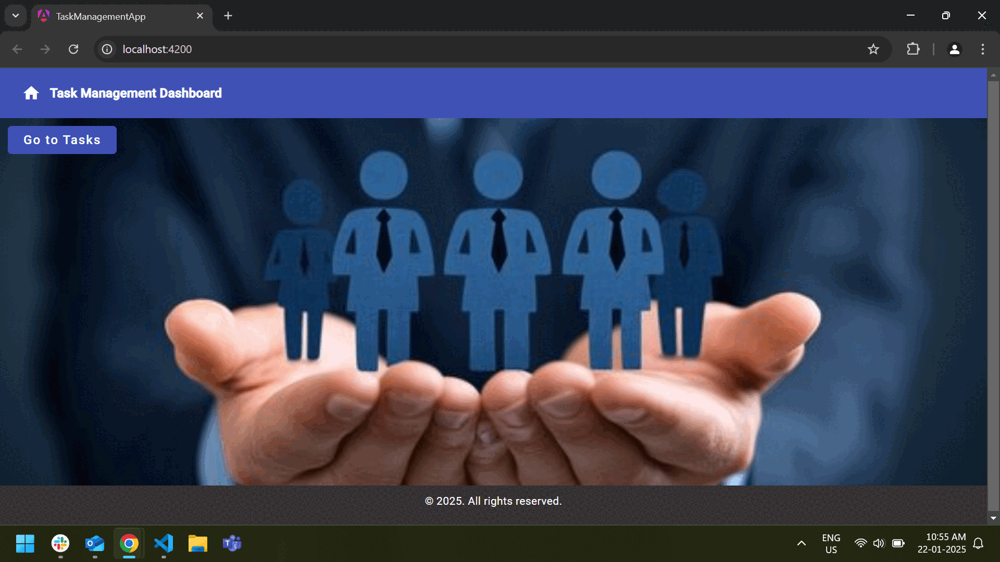

# Task Management Dashboard



# Running Task Management App on Localhost

This guide provides the steps required to run an Angular application on your local machine. The instructions assume you have Node.js and npm installed.

## Steps to Run the Angular App

### 1. Download the Angular App

Download the Angular project to your local machine.

Navigate to the project folder:

```bash
cd task_management_app
```

### 2. Install Project Dependencies

Once inside the project directory, install the necessary dependencies for the project by running:

```bash
npm install
```
or
```bash
npm install --force
```

This will download and install all dependencies specified in the `package.json` file.

### 3. Serve the Application

To start the development server and run the application locally, use the following Angular CLI command:

```bash
ng serve
```
or
```bash
npm start
```

By default, the Angular app will be available on `http://localhost:4200`.

### 4. Access the Application

Once the server starts, open your browser and visit the following URL:

```bash
http://localhost:4200
```

You should see the Angular app running locally.
